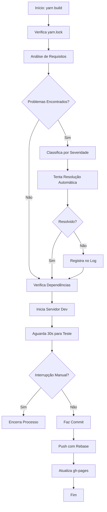

# WHFF-enD - Fundamentos do React

Deploy: https://feryamaha.github.io/WHFF-enD/

# Sobre o Projeto

Este projeto é um hub de conhecimento em React, desenvolvido como parte do processo de aprendizado, explorando conceitos fundamentais como:

- Context API
- Hooks
- Componentização
- Gerenciamento de Estado
- Estilização Moderna

A aplicação utiliza ferramentas atuais como Webpack e Babel para garantir robustez e escalabilidade. O conteúdo é atualizado continuamente com novos aprendizados em React e tecnologias front-end relevantes da WHFF.enD.

> WHFF.enD é um acrônimo para "Web Hub Fernando Front-end", representando um repositório pessoal de estudos e práticas em desenvolvimento web.

## 📖 Estrutura do Projeto

O projeto é dividido em várias partes principais:

1. **Componentes React**:

   - `App.js`: Componente principal que gerencia o estado global, tema, linguagem e navegação.
   - `Header.js`: Cabeçalho com navegação entre stacks e controle de tema/idioma.
   - `IntroSection.js`: Seção inicial com introdução às stacks disponíveis.
   - `ContentPosts.js`: Exibe os posts relacionados a uma stack e conteúdo selecionados.
   - `Post.js` e `PostHeader.js`: Componentes para exibir posts e seus cabeçalhos.

2. **Estilização**:

   - Utiliza SASS para modularidade e reutilização de estilos.
   - Arquivos SCSS organizados em `src/styles/` para cada componente.
   - Responsividade implementada com media queries.

3. **Dados**:

   - Arquivos JSON em `data/` para armazenar informações sobre stacks e conteúdos.

4. **Ferramentas de Build**:
   - Webpack para bundling e configuração de loaders (CSS, SASS, imagens, JSON).
   - Babel para transpilação de código moderno JavaScript e JSX.

## 🚀 Funcionalidades

### 1. **Gerenciamento de Tema**

- O tema pode ser alternado entre "dark" e "light" usando o botão no cabeçalho.
- Implementado com o `useState` e compartilhado via `ThemeContext`.

### 2. **Suporte a Idiomas**

- Suporte a três idiomas: Português, Inglês e Espanhol.
- O idioma pode ser alterado no cabeçalho, e os textos são atualizados dinamicamente.

### 3. **Navegação entre Stacks e Conteúdos**

- As stacks disponíveis são carregadas de `data/stacks.json`.
- A navegação entre stacks e conteúdos é gerenciada pelo estado global no componente `App`.

### 4. **Estilização Avançada**

- Estilos responsivos para diferentes tamanhos de tela.
- Uso de variáveis SCSS para temas e transições suaves.

### 5. **Deploy Automatizado**

- Configurado para deploy no GitHub Pages com o comando `yarn deploy`.

## 🛠️ Ferramentas e Tecnologias

### **Frontend**

- React 19.1.0
- React Router DOM 7.5.0
- PropTypes para validação de props.

### **Estilização**

- SASS para modularidade e reutilização de estilos.
- CSS Loader e Style Loader configurados no Webpack.

### **Build e Deploy**

- Webpack 5.98.0 para bundling.
- Babel para transpilação de código moderno.
- GH Pages para deploy automatizado.

## 📂 Estrutura de Pastas

```
WHFF-enD/
├── data/                  # Dados em JSON
│   ├── stacks.json
│   └── react-estilizacao.json
├── dist/                  # Build de produção
│   ├── assets/
│   ├── bundle5b7970a428975b852139.js
│   ├── bundle5b7970a428975b852139.js.LICENSE.txt
│   └── index.html
├── public/               # Arquivos públicos
│   └── index.html
├── src/                 # Código-fonte do projeto
│   ├── assets/         # Recursos estáticos
│   ├── styles/         # Arquivos de estilo
│   │   ├── App.scss
│   │   ├── Button.scss
│   │   ├── Header.scss
│   │   ├── IntroSection.scss
│   │   ├── Post.scss
│   │   └── reset.scss
│   ├── App.js
│   ├── Button.js
│   ├── ContentPosts.js
│   ├── Header.js
│   ├── index.js
│   ├── IntroSection.js
│   ├── Post.js
│   └── PostHeader.js
├── webpack.config.js
├── package.json
├── package-lock.json
└── yarn.lock
```

## 📦 Scripts Disponíveis

```bash
# Desenvolvimento
yarn dev    # Inicia o servidor de desenvolvimento

# Build
yarn build  # Gera os arquivos para produção

# Deploy
yarn deploy # Deploy no GitHub Pages
```

## 🔄 Atualizando o Branch gh-pages

### 1. Voltar para o Branch main

```bash
git checkout main
```

### 2. Fazer o Build

```bash
yarn build
```

### 3. Instalar gh-pages

```bash
yarn add --dev gh-pages
```

### 4. Configurar Script de Deploy

No `package.json`:

```json
"scripts": {
    "deploy": "gh-pages -d dist"
}
```

### 5. Fazer o Deploy

```bash
yarn deploy
```

### 6. Verificar Branch

```bash
git fetch origin
git branch -r
git ls-tree origin/gh-pages
```

## Requisitos Elementares para Saúde do Projeto

### Dependências Core
- Node.js >= 18.12.0
- React >= 19.1.0
- React DOM >= 19.1.0
- React Router DOM >= 7.5.0
- Prop Types >= 15.8.1

### Dependências de Desenvolvimento
- Webpack >= 5.99.5
- Webpack CLI >= 6.0.1
- Webpack Dev Server >= 5.2.1
- Babel Core >= 7.26.10
- Babel Preset Env >= 7.26.9
- Babel Preset React >= 7.26.3
- Babel Loader >= 10.0.0
- CSS Loader >= 7.1.2
- Style Loader >= 4.0.0
- SASS >= 1.86.3
- SASS Loader >= 16.0.5

### Ferramentas de Build e Deploy
- Cross Env >= 7.0.3
- GH Pages >= 6.3.0
- Clean Webpack Plugin >= 4.0.0
- Copy Webpack Plugin >= 13.0.0
- HTML Webpack Plugin >= 5.6.3

### Ferramentas de Qualidade de Código
- ESLint
- Prettier
- Jest
- @testing-library/react

### Estrutura de Diretórios
```
WHFF-enD-1/
├── src/              # Código fonte
├── public/           # Arquivos estáticos
├── dist/            # Build gerado
├── scripts/         # Scripts de automação
└── config/          # Arquivos de configuração
```

### Arquivos de Configuração Obrigatórios
- `.babelrc` - Configuração do Babel
- `.eslintrc` - Configuração do ESLint
- `.prettierrc` - Configuração do Prettier
- `webpack.config.js` - Configuração do Webpack
- `package.json` - Dependências e scripts

## Fluxograma do Algoritmo de Auto-Commit



### Detalhamento do Fluxo

1. **Verificação Inicial**
   - Verifica existência do yarn.lock
   - Gera/atualiza se necessário

2. **Análise de Requisitos**
   - Verifica versão do Node.js
   - Verifica pacotes instalados
   - Verifica configurações
   - Verifica scripts
   - Verifica estrutura de diretórios
   - Verifica arquivos essenciais

3. **Classificação de Problemas**
   - HIGH: Problemas críticos que impedem o funcionamento
   - MEDIUM: Problemas que afetam o desenvolvimento
   - LOW: Problemas de otimização

4. **Resolução Automática**
   - Instala pacotes faltantes
   - Atualiza versões
   - Cria arquivos de configuração
   - Corrige configurações

5. **Processo de Build e Deploy**
   - Inicia servidor de desenvolvimento
   - Aguarda verificação manual
   - Faz commit automático
   - Atualiza gh-pages

## Problemas Conhecidos e Soluções

### 1. Erros de Verificação de Pacotes
**Problema**: O algoritmo está falhando ao verificar pacotes via `npm audit`
**Causa**: O comando `npm audit` está retornando JSON inválido
**Solução**: Implementar verificação alternativa usando `yarn audit` ou verificação direta do registry

### 2. Configurações Faltantes
**Problema**: Arquivos `.eslintrc` e `.prettierrc` não são criados automaticamente
**Causa**: Falta de templates padrão para essas configurações
**Solução**: Adicionar templates padrão e criar os arquivos automaticamente

### 3. Scripts Faltantes
**Problema**: Scripts de teste e lint não são adicionados automaticamente
**Causa**: Falta de verificação de scripts no package.json
**Solução**: Implementar adição automática de scripts padrão

### 4. Verificação de Vulnerabilidades
**Problema**: Verificação de vulnerabilidades não está funcionando corretamente
**Causa**: Problemas com o comando `npm audit`
**Solução**: Implementar verificação usando a API do npm ou yarn

### 5. Compatibilidade de Versões
**Problema**: Verificação de compatibilidade entre pacotes não é completa
**Causa**: Falta de análise de dependências cruzadas
**Solução**: Implementar análise de grafo de dependências
